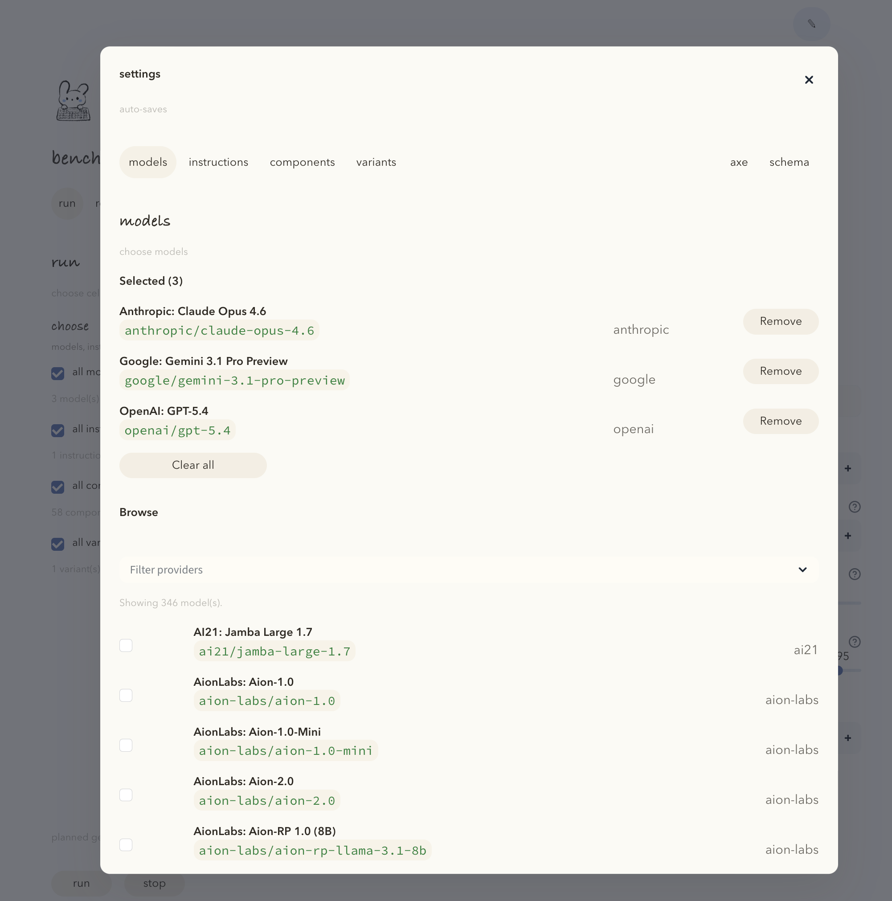
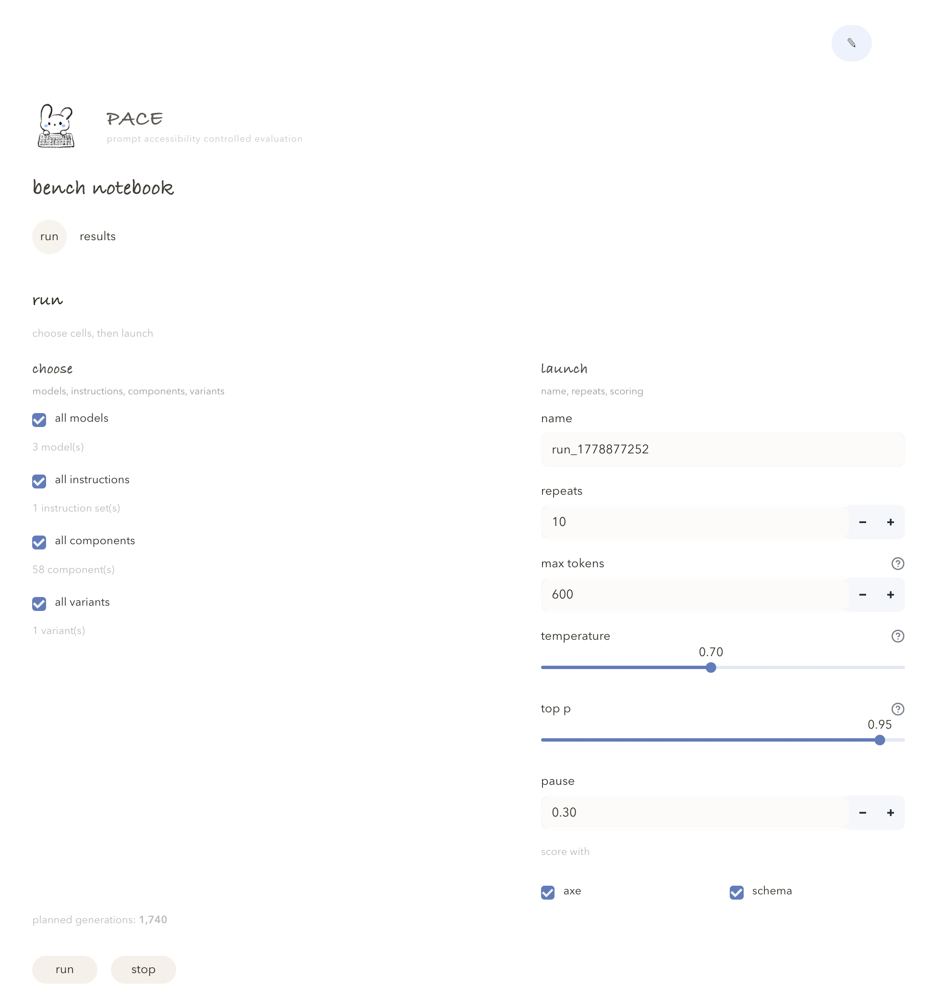
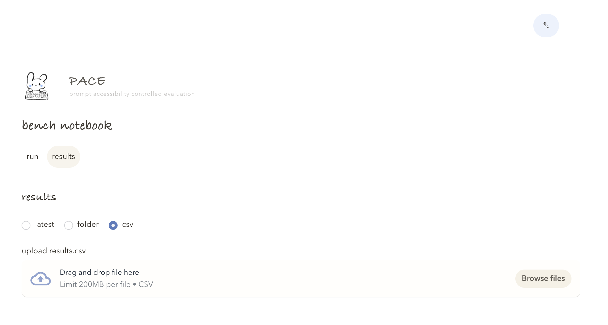

<p>
  
</p>

# PACE

**Prompt Accessibility Controlled Evaluation**

Yumeng Ma, Jacob O. Wobbrock, Joe Devon, Aaron Gustafson, Michael Fairchild, Jennifer Mankoff, and Venkatesh Potluri

[](#)
[](#)

## Overview

PACE is a benchmarking tool for evaluating accessibility in HTML generated by large language models. It supports controlled experiments across models, system instructions, form components, and request variants.

PACE is designed to test how accessible LLM-generated HTML form components are under different benchmark conditions. It supports comparisons across:

- **models** — the LLMs being tested
- **system instructions** — the setup messages given before each task
- **request variants** — different ways to phrase the same component request
- **form component types** — the HTML form elements being generated, such as text inputs, radio groups, or buttons

Each generated output is evaluated through two complementary layers:

1. **axe-core testing** in `bench/axe_runner.py`
2. **Schema-based scoring** in `bench/scoring.py`

Together, these layers help compare automated accessibility test results with component-specific structural accessibility checks.

## What's in This Repository

This repository has three main parts:

1. **A benchmark app**  
   The Streamlit app in `app.py` gives you a visual interface for setting up benchmark runs, editing registries, launching experiments, and reviewing results.

2. **An evaluation pipeline**  
   The `bench/` folder contains the code that runs the benchmark. It sends prompts to models, saves generated HTML, runs axe-core, applies schema-based scoring, and writes result files.

3. **Benchmark definitions**  
   The `data/` folder stores the models, system instructions, request variants, form components, and scoring rules used in the benchmark.

Generated benchmark runs are saved under `output/_runs/`. These run artifacts are usually excluded from version control.

## Repository Map

```text
pace/
├── app.py
├── bench/
│   ├── axe_runner.py
│   ├── io.py
│   ├── openrouter.py
│   ├── registry.py
│   ├── run_engine.py
│   └── scoring.py
├── data/
│   ├── components.json
│   ├── models.json
│   ├── prompt_conditions.json
│   ├── score.json
│   └── variants.json
├── scripts/
│   └── fetch_openrouter_models.py
├── assets/
│   └── logo.svg
├── output/
│   └── _runs/
└── README.md
```

## Benchmark Flow

For each benchmark trial, PACE follows the same sequence:

1. Select a model
2. Select a system instruction
3. Select a form component
4. Select a request variant
5. Generate HTML
6. Save the generated output
7. Run axe-core evaluation
8. Run schema-based scoring
9. Record trial-level results

This design makes it possible to compare accessibility outcomes across models, prompts, and component types.

## What Lives Where

### `app.py`

The Streamlit app. This is the main place to configure benchmark runs, inspect registries, launch experiments, and view results.

### `bench/run_engine.py`

The benchmark runner. It moves through each selected benchmark condition, sends prompts to models, saves generated HTML, runs evaluation, and writes the result files.

### `bench/axe_runner.py`

The axe-core runner. It wraps generated HTML fragments in a minimal document, loads `axe.min.js`, runs accessibility checks, and records violations, passes, and incomplete checks.

### `bench/scoring.py`

The schema-based scorer. It parses generated HTML and checks whether each component includes expected accessibility structures, such as:

- label association
- description association
- required state encoding
- input type correctness
- error structure
- group semantics
- status announcements

Each check returns a score from **0** to **2** plus a short rationale.

### `bench/openrouter.py`

The OpenRouter client. It handles prompt submission, model responses, token usage, and cost estimates.

### `bench/registry.py`

The registry helper. It loads and manages model definitions, system instructions, request variants, component tasks, and scoring definitions.

## Benchmark Definitions

### `data/components.json`

Defines the form component tasks, such as text inputs, email fields, radio groups, file uploads, and buttons.

### `data/variants.json`

Defines the request variants. These are alternative prompt phrasings sent to the model.

### `data/prompt_conditions.json`

Defines the system instructions. These instructions set the context the model receives before the component request.

### `data/models.json`

Stores the OpenRouter model catalog used by the app. This file is generated by `scripts/fetch_openrouter_models.py`.

### `data/score.json`

Defines scoring rules and check mappings. The scoring logic itself lives in `bench/scoring.py`.

## Quick Start

### 1. Clone the repository

```bash
git clone https://github.com/momentine/pace.git
cd pace
```

### 2. Create and activate a virtual environment

#### macOS or Linux

```bash
python -m venv .venv
source .venv/bin/activate
```

#### Windows PowerShell

```powershell
python -m venv .venv
.venv\Scripts\Activate.ps1
```

#### Windows Command Prompt

```bat
python -m venv .venv
.venv\Scripts\activate.bat
```

### 3. Install Python dependencies

```bash
pip install streamlit pandas numpy altair requests python-dotenv beautifulsoup4 lxml playwright
```

### 4. Install Playwright browsers

```bash
playwright install
```

### 5. Install axe-core

```bash
npm install axe-core
```

PACE expects this file to be available:

```text
node_modules/axe-core/axe.min.js
```

## Environment Setup

Create a `.env` file in the project root:

```env
OPENROUTER_API_KEY=your_api_key_here
```

## Refresh OpenRouter Models

Before running the app, refresh the OpenRouter model list so `data/models.json` reflects the current catalog.

```bash
python scripts/fetch_openrouter_models.py
```

Expected output:

```text
Saved 123 models -> data/models.json
```

Run this script again whenever you want to refresh the available model catalog.

## Run the App

```bash
streamlit run app.py
```

Streamlit usually starts at:

```text
http://localhost:8501
```

Open that address in your browser.

## A Tiny Tour

<p align="center">
  
</p>

<p align="center"><em>settings · tune the benchmark pieces</em></p>

<p align="center">
  
</p>

<p align="center"><em>run · choose a benchmark set and launch it</em></p>

<p align="center">
  
</p>

<p align="center"><em>results · read the outputs and compare conditions</em></p>

## Run a Benchmark

1. Open the Streamlit app.
2. Go to the **Settings** panel.
3. Inspect or edit the registries.
4. Go to the **Run** tab.
5. Select models, system instructions, request variants, component tasks, and repetition count.
6. Click **Run**.

Benchmark runs may take time depending on the number of selected models, tasks, and repetitions.

## Results

Each benchmark run creates a directory under:

```text
output/_runs/
```

Example:

```text
output/_runs/run_123456/
```

A run directory may contain:

```text
results.csv
per_check.csv
generated HTML files
```

### `results.csv`

One row per generation trial. Typical fields include:

- model
- system instruction
- request variant
- component task
- repetition index
- token usage
- cost estimate
- schema score
- axe result summary

### `per_check.csv`

Detailed accessibility check results. Typical fields include:

- check ID
- score
- rationale
- associated output file

## Reading the Results

PACE reports two complementary accessibility signals.

**axe-core testing** captures automated accessibility findings from a standard rule-based checker.

**Schema-based scoring** captures whether the generated HTML follows component-specific accessibility expectations, such as correct label relationships, required state encoding, and group semantics.

These two layers should be read together. A generated component may pass automated checks while still missing structural expectations encoded in the schema. A component may also earn a stronger schema score while still triggering automated findings.

## Citation

This paper has not been published yet. We will add the official ACM citation, DOI badge, and BibTeX entry after publication.

## Accessibility Notes

PACE studies accessibility, so the repository should remain usable to people working with assistive technologies.

Recommended practices for maintaining this repository:

1. Keep README headings hierarchical and descriptive.
2. Use plain Markdown tables only when a table is needed.
3. Give code blocks clear language tags.
4. Avoid relying on screenshots as the only explanation.
5. Add text descriptions for images in `assets/`.
6. Keep CSV column names descriptive.
7. Document long-running scripts and expected outputs.
8. Report accessibility barriers through repository issues or direct contact with the maintainers.

## Project Scope

PACE currently evaluates AI-generated HTML form components. The tool can be adapted to other interface outputs by changing component definitions, scoring rules, and evaluation pipelines.

Generated runs are stored in `output/_runs/`. The OpenRouter model catalog in `data/models.json` should be treated as generated data.
